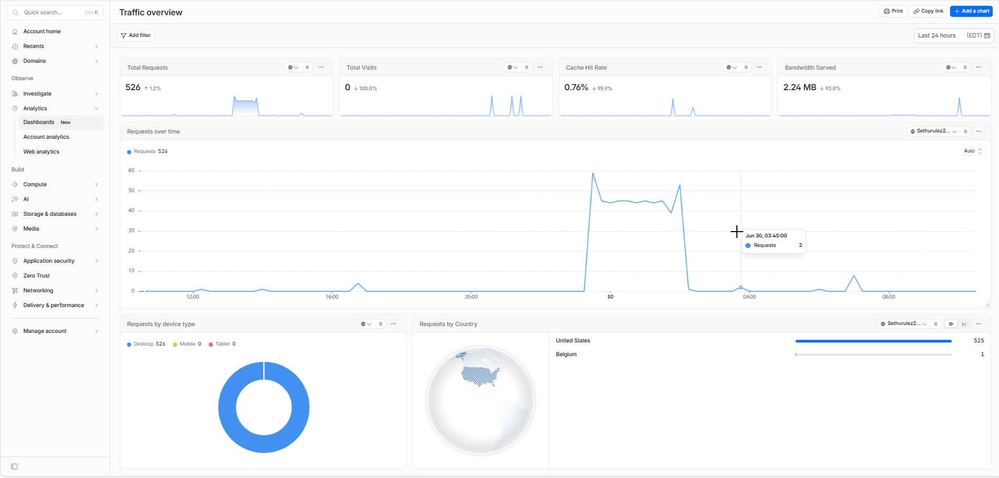

# Local Enterprise Ingress Infrastructure (Cloudflare Tunnels)

This repository tracks the configuration, deployment, and routing logic for a professional local ingress layer on Fedora Linux. The architecture securely exposes localized data engines, IDE workspaces, and MLOps platforms to the internet using Cloudflare Zero Trust Edge Tunnels (`cloudflared`), eliminating the need for risky inbound firewall rules or public port forwarding.

---



---

## 🏗️ Architecture Overview

The ingress layer establishes a persistent outbound proxy connection to Cloudflare’s global edge network:

```text
  ┌────────────────────────────────────────────────────────┐
  │                  Fedora Infrastructure Server           │
  │                                                        │
  │  ┌──────────────┐   ┌─────────────────┐   ┌─────────┐  │
  │  │ Coder (3000) │   │  MinIO (9001)   │   │ MLflow  │  │
  │  └──────▲───────┘   └────────▲────────┘   │ (5000)  │  │
  │         │                    │            └────▲────┘  │
  │         └──────────┐         │                 │       │
  │                    │         │                 │       │
  │              ┌─────┴─────────┴─────────────────┴──┐    │
  │              │    cloudflared systemd service      │    │
  │              └─────────────────▲───────────────────┘    │
  │                                │ (Outbound TLS)         │
  └────────────────────────────────┼────────────────────────┘
                                   │
                     ┌─────────────┴─────────────┐
                     │   Cloudflare Edge Network │
                     │    (*.example.com Zone)   │
                     └───────────────────────────┘
```

* **Zero-Inbound Security:** Blocks scanner traffic and brute-force attempts by keeping local network ports hidden from the public internet.
* **Edge Routing Engine:** Inspects request subdomains at Cloudflare's perimeter and proxies them safely down to local Fedora ports over encrypted TLS streams.
* **Protocol Flexing:** Handles web-native application wrappers such as HTTP/HTTPS alongside developer data pipeline layers such as PostgreSQL TCP streams.

---

## ⚙️ Service Ingress Blueprint

Traffic entering the `example.com` zone is parsed and securely routed according to this blueprint:

| Subdomain Address | Target Service Interface | Service Port | Traffic Protocol |
| :--- | :--- | :--- | :--- |
| `coder.example.com` | Coder IDE Cloud Instance | `3000` | HTTP |
| `minio.example.com` | MinIO Storage API Endpoint | `9000` | HTTP / S3 API |
| `console-minio.example.com` | MinIO Web Storage Browser | `9001` | HTTP |
| `mlflow.example.com` | MLflow Central MLOps Dashboard | `5000` | HTTP |
| `sql.example.com` | PostgreSQL Database Instance | `5432` | TCP Stream |

---

## 🚀 Step-by-Step Edge Setup (Fedora Linux)

### 1. System Directories & Security Boundary

The daemon architecture runs as an isolated system runtime tool with configuration states centralized under `/etc/cloudflared`.

#### Operational Paths

* **Binary Link:** `/usr/bin/cloudflared`
* **Configuration Blueprint:** `/etc/cloudflared/config.yml`
* **Identity Token:** `/etc/cloudflared/cert.pem`
* **Systemd Controller:** `/etc/systemd/system/cloudflared.service`

---

### 2. Binary Installation & Authentication

Install the official Cloudflare stable engine binary natively through the command line:

```bash
# Download the native cloudflared RPM release package
wget https://github.com/cloudflare/cloudflared/releases/latest/download/cloudflared-linux-x86_64.rpm

# Install through DNF package manager
sudo dnf install -y ./cloudflared-linux-x86_64.rpm

# Authorize the local terminal to manage the Cloudflare zone
cloudflared tunnel login
```

Follow the browser terminal link prompt to grant control permissions for the `example.com` zone.

---

### 3. Creating the Persistent Edge Tunnel

Provision a dedicated secure connection path for the local infrastructure server:

```bash
# Generate the named tunnel link
cloudflared tunnel create example-edge-tunnel
```

Note the returned **Tunnel UUID** string and the matching `.json` credential key file generated inside the local Cloudflare path.

---

### 4. Configuration Blueprint Management

Build a centralized multi-service application router map:

```bash
sudo nano /etc/cloudflared/config.yml
```

#### Contents

```yaml
tunnel: <YOUR-TUNNEL-UUID-HERE>
credentials-file: /etc/cloudflared/<YOUR-TUNNEL-UUID-HERE>.json

ingress:
  - hostname: coder.example.com
    service: http://localhost:3000

  - hostname: minio.example.com
    service: http://localhost:9000

  - hostname: console-minio.example.com
    service: http://localhost:9001

  - hostname: mlflow.example.com
    service: http://localhost:5000

  - hostname: sql.example.com
    service: tcp://localhost:5432

  # Global fallback catch-all configuration
  - service: http_status:404
```

---

## 5. Systemd Service Registration & Control

Lock `cloudflared` into the Fedora system backend daemon manager to maintain persistent connection streams across system reboots:

```bash
# Generate the background daemon configuration
sudo cloudflared service install

# Refresh configuration dependencies
sudo systemctl daemon-reload

# Configure the runtime daemon to activate on host boot
sudo systemctl enable cloudflared

# Control running processes
sudo systemctl start cloudflared
sudo systemctl restart cloudflared

# Check real-time service status
sudo systemctl status cloudflared
```

---

## 6. Cloudflare Routing Table Mapping

Map local subdomains to the edge proxy by adding CNAME records to the global zone DNS table:

```bash
# Sync web UI routes to edge networks
cloudflared tunnel route dns example-edge-tunnel coder.example.com
cloudflared tunnel route dns example-edge-tunnel minio.example.com
cloudflared tunnel route dns example-edge-tunnel console-minio.example.com
cloudflared tunnel route dns example-edge-tunnel mlflow.example.com
cloudflared tunnel route dns example-edge-tunnel sql.example.com
```

---

## 🔒 Verification & External Connectivity

### Verifying Web Interfaces

Open an external web browser and verify access to the exposed application endpoints:

* `https://coder.example.com`
* `https://console-minio.example.com`
* `https://mlflow.example.com`

### Verifying Database TCP Streams (`sql.example.com`)

Because raw SQL database traffic cannot be processed directly by web browsers, access the data channel using either option below.

#### Method A: Cloudflare Access Routing Companion (CLI)

From any remote computer or external client workspace terminal, map the domain back to a vacant local port:

```bash
cloudflared access tcp --hostname sql.example.com --url localhost:5432
```

Leave this running and point the IDE database navigator directly to `localhost:5432`.

#### Method B: Built-in Desktop App SSH Tunneling

Open database client tools such as **DBeaver** or **pgAdmin 4** and use the built-in **SSH Tunnel** tab. Route the connection directly to the Fedora system profile over local network configurations.

---

## 🔐 Security Notes

Do not commit the following files or values to a public repository:

```text
/etc/cloudflared/cert.pem
/etc/cloudflared/<YOUR-TUNNEL-UUID-HERE>.json
Cloudflare API tokens
Tunnel UUIDs
MinIO access keys
PostgreSQL passwords
SSH private keys
Private IP addresses
Real production domain names
```

Use placeholders such as `example.com` in public documentation.

---

## 📌 Project Purpose

This repository is intended as a learning and reference implementation for building a private AI and data infrastructure ingress layer. It demonstrates how local development, storage, database, and MLOps services can be securely routed through a controlled edge tunnel without exposing the infrastructure server directly to the internet.
